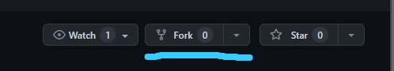
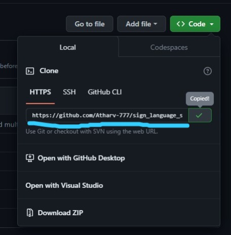
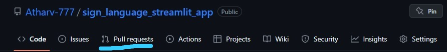
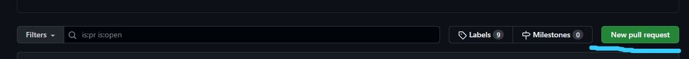
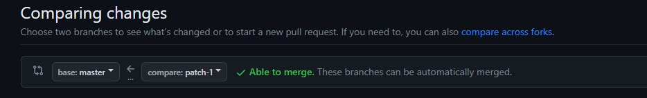

## Sign-Language-Interpreter

&emsp;The Virtual Sign Language Interpreter is a _Computer Vision_ project that aims to bridge the communication gap between hearing-impaired and non-hearing-impaired people. The project uses computer vision and deep learning to interpret sign language gestures and convert them into spoken language or text. It also supports animation based text to sign language conversion.<br>
    &emsp; For converting Sign to Text, the system uses a camera to capture the sign language gestures made by a user and processes the images using computer vision techniques such as object detection and tracking, feature extraction, and <a href="https://towardsdatascience.com/convolutional-neural-networks-explained-9cc5188c4939" style="text-decoration: none;">_Convolution_</a> to recognize the gestures. The recognized gestures are then translated into spoken language or text, which can be understood by non-hearing-impaired people.<br>
    &emsp; For converting text/speech to sign language, this system uses <a href = "https://github.com/Uberi/speech_recognition" style="text-decoration: none;">_speech_recognition_</a>
module for taking Speech input from the user and converting it into Text. The "speech_recognition" library is a Python library that provides easy-to-use interfaces to speech recognition engines, such as Google Speech Recognition, IBM Speech to Text, and Sphinx. It allows users to easily add speech recognition capabilities to their Python applications. Once text is generated using Watson AI speech-to-text API, text is used to generate a animated video which can be used by non-hearing-impaired people to convery their message to hearing-impaired/deaf people.

### Tech Stack used


### Want to contribute?

1. Fork this repo. You can fork the repo by clicking "fork" button on top-right corner.
<p align="left"></p>

2. Clone it on your local machine by simply clicking green "code" button and copying the given link.
   <p align="left"></p>

   Copy this link and open command prompt and switch to the location you want to save the project and run 
   ``` sh
   git clone https://github.com/Atharv-777/sign_language_streamlit_app.git
   ```

3. Add your changes or features.

4. Before pushing the code run following command to avoid merge conflicts
   ``` sh
   git remote add upstream https://github.com/Atharv-777/sign_language_streamlit_app.git
   git fetch upstream
   git pull upstream master
   ```
5. Stage all the changes using ```git add .```

6. Add commit message and push the changes 
   ```sh  
   git commit -m "<your message here>" 
   git push <remote name> <branch name>
   ```

7. Then go to the main repo from where the project is forked and go into **Pull Request** tab.
   <p align="left"></p>

8. Click **New Pull Request** button.
   <p align="left"></p>

9. Select the branch from forked repo you have contributed to and want to merge to the main repo and click **Create Pull Request**.
   <p align="left"></p>


And bam!:fire: thats it.
